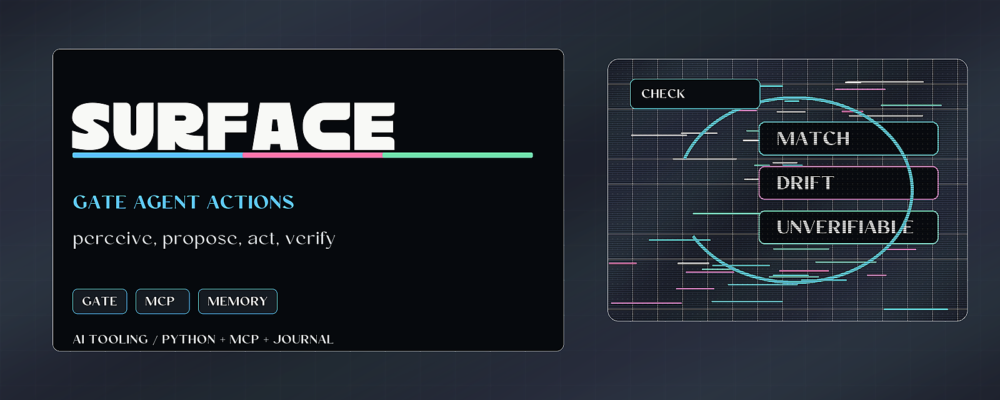

# Accountable Surface



> Gate agent actions with explicit grants, durable journals, and verification.

Accountable Surface is a Python and MCP workbench for controlled agent action.
It lets an agent perceive a bounded target, propose an action, pass that action
through an operator-loaded grant, execute only when allowed, and verify the
result afterward.

## Why it matters

Agent workflows need autonomy without silent authority. This repo gives
developers a concrete loop for reviewable action: observe, propose, gate, act,
verify, and record a receipt.

## Try it

```bash
PYTHONPATH="src;C:/path/to/sibling-package/src" python examples/demo.py
PYTHONPATH="src;C:/path/to/sibling-package/src" python -m pytest
```

## What to test first

- Run `examples/demo.py` to see the basic accountable loop.
- Run `examples/actuate_demo.py` for the actuation path.
- Run `examples/smoke_mcp.py` before wiring it into an MCP client.

## Current status

Alpha package with local examples, Python tests, and an MCP server entry point.
It depends on sibling package checkouts listed in the setup commands below.

## Developer entry points

- Python package: `src/accountable_surface/`
- MCP server: `accountable_surface.server`
- CLI script: `accountable-surface-server`
- Tests: `tests/`

## Existing technical notes

> *Senses and sensibility are what lead to the new frontier. Machines learning to hold themselves accountable.*

A live seam where a model **perceives** and **acts** only through accountability —
witnessed perception, a pre-execution gate, and a tamper-evident, durable memory —
under human stewardship. Composed from existing audited parts:
[coherence-membrane](https://github.com/HarperZ9/coherence-membrane) organs
(witnessed perception) and [proof-surface](https://github.com/HarperZ9/proof-surface)'s
gate (allow / deny / needs-human). It does **not** touch ORCA.

## Why

A parallel agent that drives a browser with Playwright and reads **screenshots**
is guessing at pixels. This surface perceives **structure** — a witnessed,
content-addressed reading with a falsifiable self-test — and gates every action
through an explicit, revocable operator grant. Perception you can audit; action
you can refuse *before* it happens. That is the substrate for safe autonomy: the
danger of "skip every permission" is bounded when every step is witnessed, gated,
and self-checked.

## The loop

```
perceive  ->  gate (allow / deny / needs-human)  ->  act (effector)  ->  verify  ->  witness
  afferent          proof-surface                    fs · web · OS       re-perceive   journal
```

- **Perceive** — organs emit witnessed `Observation`s (provenance digest + a
  falsifiable `selftest`), never screenshots.
- **Gate** — every proposed action is checked against the **operator's** grant by
  proof-surface's pre-execution gate. *The model cannot supply its own authorization.*
- **Witness** — every perception and decision is journaled; `interocept()` is the
  surface's witnessed, content-addressed view of its own conduct, durable across
  sessions (append-only JSONL + replay).

## Doctrine

- Perception is **witnessed**, never a screenshot.
- **Awareness is not authority** — the model perceives freely but cannot authorize its own actions.
- **Accountable over time** — the journal is append-only and replayed; the self-view
  is content-addressed, so the record cannot silently drift.
- **Action only on `allow`, and verified** — `propose` is advisory; `actuate`
  closes the loop: it acts ONLY on a gate `allow`, through an effector bounded by
  construction, then **verifies the effect by re-perceiving** and rolls back a
  failed reversible action. Nothing is assumed-done.

## Layout

- `src/accountable_surface/surface.py` — `AccountableSurface`: `perceive`, `propose`
  (gated), `actuate` (the full accountable-actuation loop), `interocept` (witnessed
  self-view), a durable journal.
- `src/accountable_surface/effector.py` — the efferent arm: the `Effector` contract +
  `FilesystemEffector` (inert until authorized; bounded; reversible; self-verifying).
- `src/accountable_surface/web_effector.py` — native web actuation: `WebEffector`
  (navigate / fill by label / submit, origin-bounded; **no browser, no external deps**).
- `src/accountable_surface/os_effector.py` — OS actuation: `CommandEffector`
  (allowlisted commands, bounded cwd, no shell; irreversible → needs-human).
- `src/accountable_surface/reference.py` — the **reference cortex**: a grounding organ
  (witnessed, relevance-scored references; admits "ungrounded"; native arXiv via stdlib).
- `src/accountable_surface/http_driver.py` — the real native backend: stdlib
  `html.parser` + the witnessed clean GET/POST; drives live server-rendered pages.
- `src/accountable_surface/server.py` — a FastMCP **live MCP server** exposing
  `perceive`, `propose`, `session_journal`, `interocept`.
- `tests/` — 90 tests. `examples/`: `demo.py`, `actuate_demo.py`,
  `web_actuate_demo.py` (native web actuation vs a real localhost server),
  `goal_demo.py` (bounded autonomy), `grounding_demo.py` (the reference cortex admitting
  when it can't ground), `grounded_actuate_demo.py` (an action that must cite grounded
  references), `smoke_mcp.py` (a real MCP stdio round-trip).
- `docs/` — design specs (interoception, persistence, actuation).

## Install & run

This composes two sibling repos kept off PyPI; put them on the path (or
editable-install them). **coherence-membrane must include `WebDocumentOrgan`**
(branch `feat/web-and-external-organs` or later).

```bash
PP="C:/dev/public/coherence-membrane/src;C:/dev/public/proof-surface/src"

PYTHONPATH="$PP" python -m pytest             # 34 tests (pytest adds ./src)
PYTHONPATH="src;$PP" python examples/demo.py  # runnable transcript
python examples/smoke_mcp.py                  # live MCP round-trip (needs mcp)

# the live MCP server
pip install -e ".[server]"                    # adds mcp
PYTHONPATH="$PP" python -m accountable_surface.server
```

## Wire into an MCP client

```json
{
  "mcpServers": {
    "accountable-surface": {
      "command": "python",
      "args": ["-m", "accountable_surface.server"],
      "env": {
        "PYTHONPATH": "C:/dev/public/accountable-surface/src;C:/dev/public/coherence-membrane/src;C:/dev/public/proof-surface/src",
        "ACCOUNTABLE_SURFACE_GRANTS": "C:/path/to/operator-grants.json",
        "ACCOUNTABLE_SURFACE_JOURNAL": "C:/path/to/session-journal.jsonl"
      }
    }
  }
}
```

### Operator grants (`ACCOUNTABLE_SURFACE_GRANTS`)
A JSON file with one authorization-grant or a list. **The model cannot supply its
own authorization** — only operator-loaded grants gate actions; with none loaded,
the gate is **default-deny**. The grant is the autonomy envelope: its
`scope.allowed_actions` / `allowed_targets` bound what the surface may do.

### Durable memory (`ACCOUNTABLE_SURFACE_JOURNAL`)
A path to an append-only JSONL file. When set, the journal replays on launch and
appends every perception/decision — so the witnessed self-view spans sessions.

## Roadmap

**Built (v0):** witnessed perception · pre-execution gate · interoception · durable
memory · live MCP server · **the efferent arm** — accountable actuation with **three
native backends** (`FilesystemEffector`; `WebEffector` on a real stdlib HTTP/HTML
driver — navigate, fill by label, submit; `CommandEffector` for allowlisted OS
commands), acting on *structure* not pixels, through the perceive→plan→gate→act→
re-perceive→verify loop with rollback. **Irreversible** actions (a POST, a command)
escalate to needs-human unless the operator passes `allow_irreversible`. Built to
*surpass* Playwright for server-rendered web — no browser binary. **Goal/task mode**
(`pursue`) runs a multi-step plan as **bounded autonomy** — one grant envelope, no
per-step prompt — halting the instant a step is denied or fails verification. A plan
(even a model's plan) is not authority; each step earns it. The **reference cortex**
(`ground`) returns witnessed, relevance-scored references for a subject and flags
**ungrounded** rather than surface an irrelevant citation — grounding that can't launder
a bad source. It is **wired into actuation**: an action may carry a *justification*; an
**ungrounded premise escalates to needs-human** (evidence gated like authority), and the
references ride along on the outcome as the action's citation.

**Next:** richer goal **planning** (decompose a goal into steps, each still gated); a
larger curated/internal corpus behind the reference cortex; and a native protocol option
for the live surface. **Zero external dependencies
in the core** — stdlib + the sibling-native repos; the optional MCP server (`[server]`
extra) is the lone edge-adapter. Four pillars: **Accountability, Usability,
Accessibility, Efficiency**.

## License

MIT (c) 2026 Zain Dana Harper
