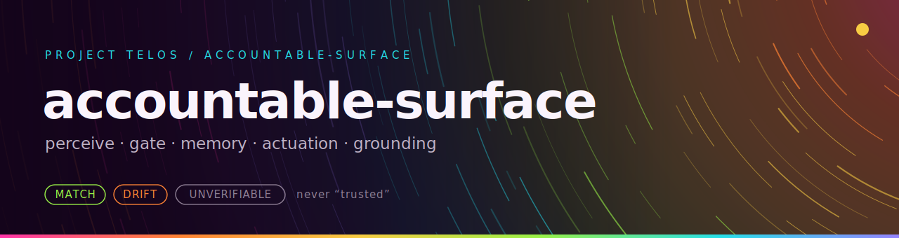

<p align="center"></p>

**Perceive, gate, memory, three-channel actuation, grounding. A live surface in one zero-dependency package.**

 

Accountable Surface is a Python workbench for controlled agent action. An agent perceives a target as structure, proposes an action, passes an operator-loaded gate, acts through a bounded effector, verifies the result by re-perceiving, and records everything in a durable journal. The core is stdlib only: no browser binary, no HTTP client library, no framework.

## Features

- **Native web actuation, no browser.** `WebEffector` navigates, fills fields by their visible label, and submits forms on live server-rendered pages, driven by a stdlib HTTP and HTML parser backend (`HttpDriver`). Origin-bounded by construction.
- **JS-capable browser actuation, optional.** `BrowserEffector` clicks by accessible label, follows navigation, and runs JavaScript on single-page apps. Tests and offline demos use the deterministic `FakeBrowserDriver`; production can inject `PlaywrightDriver` (the `[browser]` extra, lazily imported, never a hard dependency).
- **OS command actuation.** `CommandEffector` runs allowlisted commands only, as argv with `shell=False`, in a bounded working directory. Irreversible commands escalate to needs-human.
- **Filesystem actuation with rollback.** `FilesystemEffector` is bounded to a root, verifies its own writes by re-perceiving, and rolls back a reversible action that fails verification.
- **Structured perception.** Organs read a target as a content-addressed structural observation with a falsifiable self-test, not a screenshot.
- **Grounding.** A reference cortex (`ReferenceCortex`) scores reference relevance for a subject and reports "ungrounded" instead of guessing, with native arXiv lookup via the stdlib. An action can carry a justification; an ungrounded premise escalates to needs-human.
- **Bounded autonomy.** `pursue` runs a multi-step plan under one grant envelope with no per-step prompt, halting the instant a step is denied or fails verification.
- **Shared world server.** A zero-dependency live server (stdlib `http.server` plus SSE) where proposed actions run the real loop and stream to every open browser tab, with a small web UI in `web/`. Optional pilots connect a model (Claude or Ollama) to drive it.
- **Durable memory and interoception.** An append-only JSONL journal that replays across sessions, and `interocept()`, a content-addressed view of the surface's own conduct.
- **Live MCP server.** `perceive`, `propose`, `session_journal`, and `interocept` exposed over MCP stdio (the `[server]` extra).
- **Action certificates.** `certify` composes the gate, effect, and grounding verdicts into one certificate token; a denial or failed effect makes the whole action REFUTED, and an escalation yields UNVERIFIABLE, never a rounded-up pass.

The gate is default-deny: with no operator grant loaded, nothing acts. The model cannot supply its own authorization.

## Install

The core composes two sibling repos kept off PyPI. Clone them next to this one and put them on the path. coherence-membrane must include `WebDocumentOrgan` (branch `feat/web-and-external-organs` or later).

```powershell
git clone https://github.com/HarperZ9/accountable-surface.git
git clone https://github.com/HarperZ9/coherence-membrane.git
git clone https://github.com/HarperZ9/proof-surface.git
cd accountable-surface
$env:PYTHONPATH = "src;..\coherence-membrane\src;..\proof-surface\src"
python -m pip install -e ".[test]"
```

Requires Python 3.10+. The package itself declares zero runtime dependencies.

## Quickstart

```powershell
python examples/demo.py        # perceive, gate allow, gate deny, journal
python examples/actuate_demo.py  # the full act-verify-rollback loop
python -m pytest               # the test suite (223 tests)
```

`demo.py` prints a witnessed structural reading of a local page (title, links, sha256 digest), then a gate ALLOW for an action inside the grant, a gate DENY for one outside it, and the journal of every perception and decision.

More transcripts: `web_actuate_demo.py` (native web actuation against a real localhost server), `spa_actuate_demo.py` (the JS-capable browser path, offline), `goal_demo.py` (bounded autonomy), `grounding_demo.py` and `grounded_actuate_demo.py` (the reference cortex), `smoke_mcp.py` (a real MCP stdio round-trip).

## Worked example

An operator grant is a plain JSON object. The surface acts only when the gate allows the exact plan, then verifies the effect on disk.

```python
from accountable_surface import AccountableSurface, FilesystemEffector

grant = {
    "authorization_version": "0.1",
    "receipt_id": "rcpt-example",
    "kind": "authorization-grant",
    "principal": {"id": "operator-1", "role": "operator"},
    "agent": {"id": "example-agent"},
    "intent": "write the report file",
    "scope": {"allowed_actions": ["fs.write"], "allowed_targets": []},
    "granted_at": "2026-06-19T00:00:00+00:00",
    "expires_at": "2030-01-01T00:00:00+00:00",
    "revoked": False,
}

surface = AccountableSurface()
out = surface.actuate(
    FilesystemEffector("/path/to/sandbox"),
    target="/path/to/sandbox/report.txt",
    content=b"written natively, verified by re-perceiving",
    authorization=grant,
)
print(out.acted, out.decision, out.verified)  # True allow True
```

With `authorization={}` the same call returns `acted=False, decision="deny"` and the file is never created. A faulty effector that writes the wrong bytes is caught at verification and rolled back; `examples/actuate_demo.py` shows both paths.

## Run as an MCP server

```powershell
python -m pip install -e ".[server]"   # adds mcp
python -m accountable_surface.server   # or: accountable-surface-server
```

Client configuration:

```json
{
  "mcpServers": {
    "accountable-surface": {
      "command": "python",
      "args": ["-m", "accountable_surface.server"],
      "env": {
        "PYTHONPATH": "C:/dev/public/accountable-surface/src;C:/dev/public/coherence-membrane/src;C:/dev/public/proof-surface/src",
        "ACCOUNTABLE_SURFACE_GRANTS": "C:/path/to/operator-grants.json",
        "ACCOUNTABLE_SURFACE_JOURNAL": "C:/path/to/session-journal.jsonl"
      }
    }
  }
}
```

`ACCOUNTABLE_SURFACE_GRANTS` points to a JSON file with one authorization grant or a list; with none loaded the gate is default-deny. `ACCOUNTABLE_SURFACE_JOURNAL` points to an append-only JSONL file; when set, the journal replays on launch so the witnessed self-view spans sessions.

## Shared world server

A live surface you can watch in a browser: proposed actions run the real perceive-gate-act-verify loop and stream over SSE to every open subscriber.

```powershell
python -m accountable_surface.world.server 8808
```

It serves the web UI from `web/` and binds to localhost by default. Grants are operator-supplied at startup; the built-in fallback is an explicit sandbox-scoped demo grant, and default-deny still holds.

## Layout

- `src/accountable_surface/surface.py`: `AccountableSurface` with `perceive`, `propose`, `actuate`, `pursue`, `interocept`, and the durable journal.
- `effector.py`, `web_effector.py`, `browser_effector.py`, `os_effector.py`: the four effectors and their drivers.
- `http_driver.py`: the stdlib HTTP and HTML backend behind native web actuation.
- `playwright_driver.py`: the optional JS-capable browser driver.
- `reference.py`: the grounding cortex, `certify.py`: action certificates, `grant.py`: grant helpers.
- `server.py`: the MCP server. `world/`: the shared world session, server, sight, and pilots.
- `tests/`: 223 tests. `examples/`: eight runnable transcripts. `web/`: the shared world UI plus Node tests.
- `docs/`: design specs (`SPEC-actuation.md`, `SPEC-interoception.md`, `SPEC-persistence.md`), design notes, and [docs/INTRODUCTION.md](docs/INTRODUCTION.md), the first-ten-minutes guide.

## Status

Alpha, version 0.1.0. The API is settling and may change between 0.x releases. CI runs the Python suite and the Node web tests on every push and pull request, with sibling checkouts of coherence-membrane and proof-surface. Local verification:

```powershell
$env:PYTHONPATH = "src;..\coherence-membrane\src;..\proof-surface\src"
python -m pytest
node --test web/*.test.mjs
```

## Related repos

- [coherence-membrane](https://github.com/HarperZ9/coherence-membrane): the perception organs and certificate types this surface composes.
- [proof-surface](https://github.com/HarperZ9/proof-surface): the pre-execution gate (allow, deny, needs-human).
- [USAGE.md](USAGE.md): the operational guide, including the browser backend.

## Why the gate and the journal

Agent autonomy without silent authority: every action here is checked against an operator grant before it runs, verified against its intended effect after it runs, and recorded in a journal you can replay and re-check. The receipt is the floor; the features above are the point.

## License

MIT (c) 2026 Zain Dana Harper
